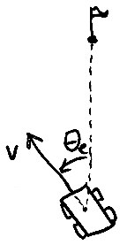
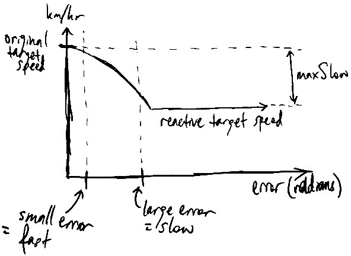
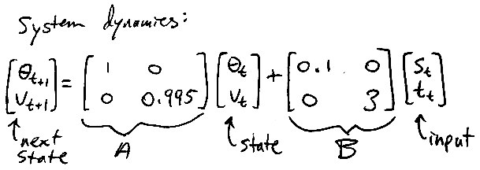
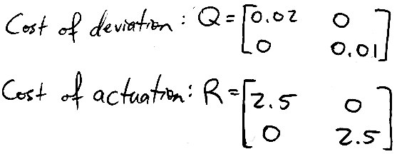
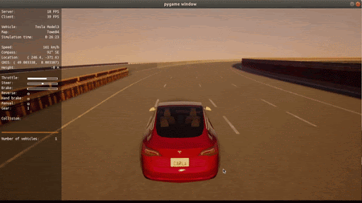
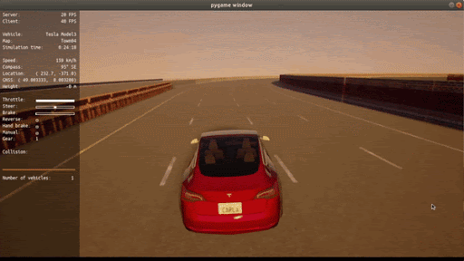

# ROAR: Robot Open Autonomous Racing

This website describes the work that Alfredo, Alvin, Aman, Sihao, and Wesley did for their EECS 106A/206A final project at UC Berkeley during Fall 2020.


## Table of contents
1. [Introduction](#introduction)
1. [Design](#design)
    1. [Sensing and Planning](#design_sense_planning)
    1. [Controlling](#design_control)
    1. [Racing](#design_racing)
1. [Implementation](#implementation)
    1. [Sensing](#impl_sense)
    1. [Planning](#impl_plan)
    1. [Controlling](#impl_control)
    1. [Racing](#impl_racing)
1. [Results](#results)
    1. [Sensing and Planning](#results_sense_plan)
    1. [Controlling](#results_control)
    1. [Racing](#results_racing)
1. [Conclusion](#conclusion)
1. [Team](#team)

   
## Introduction <a name="introduction"></a>

For our final project, we participated in [Berkeley’s ROAR competition](https://vivecenter.berkeley.edu/research1/roar/), in which teams raced 1/10th scale self-driving cars around a track and competed for various prizes. Due to the pandemic, for 2020 this competition was done through a Carla simulation, and each team was provided with the same [starter code](https://github.com/augcog/ROAR) to build off of. We were fortunate enough to win the Grand Prize for this year’s *2020 ROAR S1 series* and have published [our code](https://github.com/asdegoyeneche/ROAR) in all of its messy glory on GitHub. 

However, the end goal of our project was not only to win a race, but also to create a simplified model of an autonomous mobility-as-a-service system (think Uber or Lyft with self-driving vehicles, or your Tesla driving people around while you work an office job). As such, in addition to driving at high speeds, we were interested in following lanes and traffic signals, detecting and avoiding obstacles in our path, and providing a smooth and stable ride, which made our project more interesting than just a racing project.


## Design <a name="design"></a>

We worked in a world where the car knew its current speed, position, and orientation in a *world frame* (either via speedometer, GPS, and compass or through Carla magic) and was controlled by a steering wheel and a gas pedal (known in Carla as *steering* and *throttle*, respectively). There was also a brake pedal, but that was more for decoration than anything. The car was provided with a list of *waypoints* (with coordinates in the world frame) that traveled along the desired route. In our project, these waypoints were provided in a text file, but can also be generated by something like Google Maps in the real world. There were lane lines on the road, barriers along the sides of the road, and an occasional stationary car or barrier in the middle of the road to keep things interesting.

Given this setup, our goals were to detect lanes and obstacles, plan a path that roughly follows the given waypoints while staying in our lane and avoiding obstacles, and control the car so that it drives smoothly and accurately along our planned path. For the race, we didn’t worry about lanes and obstacles and instead modified our waypoints and controlled the car so that it went as fast as possible with minimal crashing.

With these goals in mind, we split these tasks into four parts -- sensing, planning, controlling, and racing -- and made the following design choices:

### Sensing and Planning  <a name="design_sense_planning"></a>

Only using pre-recorded waypoints, the controller in the starter code is able to run a loop without the assistance of perception. However, there are some zig-zags in the path due to the poor quality of the waypoints. In order to overcome this, we optimize the path by letting the car follow the lane center and avoid objects. We use a front RGB camera to detect white and yellow lane segments in front of the car and use a front depth camera to calculate their 3-D coordinates. Instead of only following lanes, which sometimes cannot be detected, we use lanes as an augmentation to “correct” improper waypoints. That is, the input of the controller is decided by a combination of lane center and pre-recorded waypoints. This design allows us to generate a smooth path when lanes are visible and follow the waypoints when lanes are not visible.

### Controlling <a name="design_control"></a>

The controller receives the coordinates of the next waypoint and the desired speed from the path planner. From this, we found the *difference in speed* between our current speed and target speed and the *difference in angle* between our current trajectory and the next waypoint (see figure below), and selected steering and throttle values to correct any deviation.



The starter code came with two separate [PID controllers](https://en.wikipedia.org/wiki/PID_controller), but we found this difficult to tune due to the mental mismatch between the quantitative *K<sub>p</sub>, K<sub>i</sub>, K<sub>d</sub>* parameters and the qualitative desired behavior (e.g. “more sensitive steering”). Additionally, there was no coordination between steering and throttle, which resulted in very aggressive turns, and the PID controllers did not account for the drag of the car, which resulted in the car going ~10% slower than the target speed.

To correct these issues, we made two notable changes. First, we added reactive speed control, which reduced the target speed when there was a large error in direction. This allowed us to slow down as we turned and resulted in smoother turns and better recovery when off-track with a small trade-off in speed. Second, we designed and implemented an [LQR controller](https://en.wikipedia.org/wiki/Linear%E2%80%93quadratic_regulator) to use instead of the PID controllers. This enabled the controller to account for the car’s dynamics (e.g. drag) when selecting steering and throttle values, which resulted in more accurate adherence to the planned path. The parameters used in the LQR were also more intuitive to tune than the parameters in the PID. For instance, if the car was veering back and forth from over-steering, we could increase the *cost* of steering in the LQR controller, and the controller would steer less aggressively. This ease of tuning allowed us to get significantly better performance and reach higher speeds when compared to the PID controllers. However, although the LQR had better performance than the PID, it was also significantly more complex. We had to spend a lot of time determining the system dynamics of the car and finagling the LQR math to converge to a non-zero desired trajectory. The grimy details of the LQR controller can be found in the [Implementation section](#impl_control).

### Racing <a name="design_racing"></a>

For the racing aspect, we optimized our route and speed based on previously acquired track waypoints. These waypoints can be acquired at lower speeds with other sensing and planning strategies such as our lane following module. We optimized our controllers for high speeds and implemented a waypoint smoothing and look-ahead algorithm to take turns more smoothly, cut in on the corners, and adjust the speed accordingly. 

## Implementation <a name="implementation"></a>

### Sensing  <a name="impl_sense"></a>

#### Lane Detection


The lane detector takes the images captured by the front RGB and depth camera as input and calculates the 3-D world coordinates of the left lane, right lane, and lane center in sight. At each time step, the procedure of lane detection algorithm is as follows:

- Converts the original RGB image to a grayscale image.
- Calculates the canny edges of the image.
- Cuts out two triangle-shaped areas of interest, one on the left bottom part of the image, another on the right bottom part.
- Calculates hough lines from each image and takes their average to form two straight lines as our detected lanes.
- Calculates world coordinates of lanes using depth camera image.
- Use the average of world coordinates of the left and right lanes as the lane center.

### Planning  <a name="impl_plan"></a>

#### Lane Following

`ROAR/planning_module/local_planner/lane_following_local_planner.py` contains the main logic of our lane following planner. We define a variable, confidence, which is a scalar between 0 and 1. It decays exponentially when a lane is not detected, and is reset to 1 when both are detected.  We calculate the target location based on a weighted sum of the mid point of lane center and the next waypoint. We also limit the target speed by confidence. The location of the next waypoint and target speed are then fed into our controller. The pseudocode of the lane following algorithm is as follows:

```python3
def follow_lane(waypoints, α: confidence decay rate 0 ~ 1, β: speed limit factor > 0):
    confidence = 1
    for each step:
        left_lane, right_lane, lane_center = detect_lanes_from_camera_input()
        if left_lane or right_lane not detected:
            confidence = confidence * α
        else:
            confidence = 1
        target_location = mid_point(lane_center) * confidence + 
                              get_next_waypoint(waypoints) * (1 - confidence)
        target_speed = maximum_speed * exp((1 - confidence) * -β)
        controller.run(target_location, target_speed)
```

### Controlling <a name="impl_control"></a>

The reactive speed control is a straightforward concept that boils down to one line of code in `ROAR/control_module/lqr_controller.py`:

```python3
target_speed *= max((math.cos(self.errBoi) - 1) * self.slowdown, -self.maxSlow) + 1
```

Here, self.errBoi describes the error in the direction the car is going, self.slowdown is a multiplier to increase or decrease how much we slow down given a particular error in direction, and self.maxSlow is the maximum amount that we want to slow (just so we don’t come to a complete stop when we are very off-track). There’s a couple moving parts, so hopefully the graphical representation below is helpful. 



The LQR controller, on the other hand, is a bit more complicated. `ROAR/control_module/lqr_controller.py` contains the guts of our LQR controller, which uses the parameters stored in `ROAR_Sim/configurations/lqr_config.json`. Those who are familiar with LQR controllers can check out those files directly. For those unfamiliar with LQR controllers, we have written up an explanation of how an LQR controller works and how we built ours.

#### LQR controllers

An LQR controller consists of two main components:  
1. system dynamics, and
2. costs

The system dynamics is a linear model of how the system (a self-driving car) changes state (speed and direction of motion) based on its current state and external inputs (steering and throttle). This is the “linear” part of the linear quadratic regulator. The linear model used in our LQR controller is shown below. We used a discrete-time system, where each time step was 0.03 seconds (as determined by Carla magic). We will explain later how we got the numbers we use, but for now the important thing is we have an *A* and *B* matrix that describe the intrinsic physics of the car.



The costs are the knobs we can turn to change the qualitative behavior of our controller. There are two types of costs: cost of deviation and cost of actuation. The costs used in our first functional LQR controller are shown below. The cost of deviation is applied to the state *x* of the car (angle and speed) and the cost of actuation is applied to the inputs *u* to the car (steering and throttle). We see that we care a bit more about going in the right direction than going at the right speed (since the 0.02 cost in angle is more than the 0.01 cost in speed), and we are very gentle with the steering and throttle (relatively high cost of 2.5 for both steering and throttle).



To be more mathematically precise, these costs are multiplied by the squares of the states and inputs and summed together to form a cost function *J* as shown below. This is the “quadratic” part of the linear quadratic regulator. Our goal is now to select a sequence of inputs *u* (i.e. steering and throttle values) that minimizes this cost. (It’s also worth noting that we use an infinite time horizon for our LQR controller to simplify our calculations, but that doesn’t affect the behavior of the controller very much, so you don’t have to worry too much about that.)


To actually calculate the inputs that minimize our cost function, we solve this thing called a *discrete-time algebraic Riccati equation* using our *A*, *B*, *Q*, and *R* matrices, and use the resulting *P* matrix along with our system dynamics *A* and *B* to generate a linear feedback matrix *K* such that *u = -Kx* is the optimal control. This math is kind of gross and does not need to be understood in order to use the LQR, so we will not go into detail here. The code for this optimization is also very succinct (literally two lines) because it utilizes the SciPy library, but if you’d like to read those two lines and consider the depth of their meaning, check out the *_dlqr* method in `lqr_controller.py`.

“Wait a second,” you say, “I’m a bit confused on something. If the cost of deviation is multiplied by the square of the state, doesn’t that mean by minimizing the costs, we drive the state to zero? That means that the LQR controller just makes the car face a certain direction and while going 0 km/hr! Doesn’t seem very race-worthy to me.” And you are completely correct! An LQR naturally pushes everything (including the speed of the car) to zero, which is the “regulator” part of the linear quadratic regulator. In order to follow a desired trajectory and use the LQR as a controller, we need to change where “zero” is. For the direction the car goes in, this is reasonably straightforward -- zero is just the direction to the next waypoint. Speed is a bit more tricky, because the drag of the car is proportional to the speed, so the amount of throttle needed to maintain a particular speed changes depending on said speed. For our LQR controller, we calculate the desired throttle needed to maintain the desired speed, find the difference between our current speed and the desired speed, and run the LQR on that difference to drive it to zero. We then add the throttle value it spits out back to the desired throttle and use that as our next input. In equilibrium, this results in the car going in the desired direction at the desired speed. This is all implemented in `lqr_controller.py`, so take a look at that if you are interested in the actual code.

That’s all there is to an LQR controller! “Hold up,” you say, “That’s all fine and dandy, but where did these *A*, *B*, *Q*, and *R* matrices even come from? How would I make them myself?” Glad you asked!

#### A, B, Q, and R matrices

The system dynamics *A* and *B* were by far the most difficult to determine. In addition to figuring out what numbers go into the matrices, we had to consider what state variables to include (e.g. position, velocity, acceleration, jerk, direction, angular velocity, angular acceleration, roll, pitch, yaw, derivatives of roll, pitch, yaw, etc, etc, etc) based on what linear relations (if any) existed between them and each other and what linear effects the inputs had on them. To explore this, we recorded the position, velocity, and orientation of the car, the position of the next waypoint, and the inputs to the car as it drove around the track using the tuned PID controllers. These datafiles (along with the Jupyter Notebooks used to explore the data) can be found in the [carla_driving_data directory](https://github.com/asdegoyeneche/ROAR/tree/master/carla_driving_data) of our GitHub repository.

Once we collected this data, we tossed it into a Jupyter Notebook and graphed the candidate state values pairwise against each other and against the inputs to identify any trends. We initially selected direction, angular velocity, speed, and acceleration as our state variables and ran some linear regressions to get rough estimates of what the values in the matrices should be. We then constructed our LQR controller and finagled the LQR math to follow a desired trajectory based on simulated system behavior.

After the math behind our LQR controller started working, we implemented a Carla agent and controller for the LQR and tossed our matrix values into a configuration file. Then we ran a lot of trials to refine the values in our *A* and *B* matrices. We ended up simplifying the system dynamics to only include two state variables, and tuned the drag of the car and the effects of steering and throttle until the car reached equilibrium at the target speed and didn’t seem to over/undercorrect when steering. After much eyeballing, we threw our hands up and said, “Good enough!” and thus our *A* and *B* matrices were born.

Finally, all that is left to do is to tune our *Q* and *R* matrices until the car does what we want it to do. Our initial values in *Q* and *R* were grossly suboptimal, but through some experimentation, we found that decreasing the values in *Q* and *R* by a couple orders of magnitude resulted in finer adjustments of the steering and throttle, and by keeping cost of actuation relatively high, we could achieve a smoother ride as desired. 

It’s worth mentioning again that although this seems like a lot of trial and error, tuning an LQR controller (after establishing the system dynamics) is still a lot more intuitive than tuning a PID controller. If the car is wobbling back and forth too much, increase the cost of steering. If the car doesn’t turn fast enough, decrease the cost of steering. Very easy.


### Racing <a name="impl_racing"></a>

#### Smooth Waypoint Following Planner

`ROAR/planning_module/local_planner/smooth_waypoint_following_local_planner.py` contains the main logic for our smooth waypoint lookahead path planner. From our waypoints, we look ahead `smooth_factor` waypoints for path smoothing and `speed_lookahead`  for defining our target speed factor. The target waypoint provided to the controller is obtained by averaging the `smooth_factor` points ahead. However, this can be quite computationally expensive, thus uniform sampling from these is used instead. Then, for our proactive speed control, we compute the angle relative to the car’s current orientation of the waypoint `speed_lookahead` steps ahead. Finally, our target speed for our controller is multiplied by a factor that is decreases linearly when this error increases. The pseudocode is as follows:

```python3
def next_waypoint_smooth_and_speed(self, smooth_factor: int, speed_lookahead:int ) -> (Transform, float):
            
    sample_points = range(0, smooth_factor, smooth_factor // sample_factor)
    num_points = len(sample_points)             
    mean_location = reduce(lambda x, y: x + y, (self.way_points_queue[i].location for i in sample_points))  / num_points           
    mean_orientation = reduce(lambda x, y: x + y, (self.way_points_queue[i].rotation for i in sample_points)) / num_points            
    target_waypoint = Transform(location=mean_location, rotation=mean_rotation)

    angle_difference = self._calculate_angle_error(self.way_points_queue[speed_lookahead])
    speed_multiplier = max(min_speed_factor, (1.0 - alpha * angle_difference / np.pi))

    return target_waypoint, speed_multiplier
```

The returned values are passed into the controller `run_in_series` method.

## Results  <a name="results"></a>

Now we get to show our fun little videos of the car driving!

### Sensing and Planning  <a name="results_sense_plan"></a>

Our car successfully detects and follows lanes at lower speeds (50 km/hr)! Below are two instances of the car driving. The one above directly follows the waypoints, while the one below includes lane-keeping. 

 



And here's a side-by-side comparison, with no lane-keeping on the left, and lane-keeping on the right. Notice the wild swerving when the car attempts to turn without any lane-keeping, and the lack thereof with the help of lane-keeping. 


No Lane Keeping        |  Lane Keeping
:-------------------------:|:-------------------------:
 | 


We found that it was difficult to keep track of lanes denoted by dashed lines because the dashes were short and spaced rather far apart. This problem was exacerbated during turns, where the dashed lines in a lane were not even aligned with each other, making it difficult to stay in our lane while turning at higher speeds.

We were also able to detect obstacles in front of the car, as seen below, but did not have enough time to incorporate it into our planning for obstacle avoidance.

[video or image of car detecting obstacles?]

### Controlling <a name="results_control"></a>
The LQR controller performed notably better than the original PID controllers. Below we can see two instances of the car. The one on the left is using the PID controllers, while the one on the right is using the LQR controller. Notice the behavior of the car after the turns in both GIFs - there is a substantial difference in the stability of the car, with the LQR controller providing much better performance than the PID controller. We tuned both controllers as well as we could.

PID Controller         |  LQR Controller
:-------------------------:|:-------------------------:
 | 


### Racing  <a name="results_racing"></a>

The waypoint-lookahead planner allowed us to take turns more smoothly and cut in on the corners. Below are two instances of the car taking a turn. The one on the left is without the lookahead, while the one on the right uses waypoint lookahead.

No waypoint lookahead smoothing       |  Waypoint lookahead smoothing
:-------------------------:|:-------------------------:
 | 


We found that the performance of the lookahead planner was dependent on the speed of the car, the placement of the waypoints, and the shape of the turn. Thus, we do not know how well this planner will perform on an arbitrary track that we haven’t seen before. However, as seen above, given the opportunity to tune the speed of the car and the amount we look ahead, we can achieve very good turns.

We submitted our car to the ROAR competition and won the  [Grand Prize for this year’s 2020 ROAR S1 series](https://vivecenter.berkeley.edu/research1/roar/), reaching a max speed of 188 km/hr along a figure-eight shaped track. A video of our car running a single lap can be found below. There are some tight corners and some instances where the car slows down unnecessarily, but overall the racing portion performed quite well.



## Conclusion  <a name="conclusion"></a>

We successfully achieved most of our goals for this project! Our lane detection and obstacle detection are functional and we have implemented lane-keeping in our path planner. The LQR controller provides us with a smooth ride and our waypoint-lookahead planner is very suitable for racing at high speeds. It is unfortunate that we were unable to implement obstacle avoidance, but given our current work, our car can pick up a rider and drive to a desired drop-off location while following lanes! Granted, it will be running through red lights and demolishing pedestrians, but that just means it works best at, like, 3 am!

One of our biggest difficulties was a lack of regular communication between our team members. Of course, there were design questions of what we wanted our project to do and how each person’s work fit into the whole, and there were technical challenges of how to actually implement what we want, but we feel that much of that could have been resolved more efficiently through a brainstorming session, or having two or three people troubleshooting a problem, or catching up more frequently on what each person has done and how that affects the parts of the project that other people are working on. Instead, after distributing tasks and submitting our proposal, our group didn’t meet up again (or even talk to each other) for the next five weeks. During that time, a couple of us started working on our tasks, got stuck, and gave up without asking the rest of the group for help. Other group members were busy with other coursework and research, and did not make any notable progress. By the time we finally met up again, there was only one and a half weeks left before the presentation and ROAR competition, and we only had two partially-functional components. After that, we started meeting more frequently, posting our progress and updates in our group chat, and brainstorming and troubleshooting with each other as necessary, which let us make tremendous progress during that last week and create a project worth presenting on and competing with, but I wonder how much more we could have done if we had just talked to each other earlier.

With additional time, we would have focused on merging obstacle detection with some form of planning so that the car would be able to avoid obstacles such as other vehicles, the sides of the track, and barricades on the track. We also wanted to implement image segmentation using the RGB camera feed from the car, which would have allowed us to distinguish the track from all the other components of the feed, and optimize the car's speed using this additional signal along with our existing lane detection and waypoint planning algorithms.

## Team  <a name="team"></a>

**Alfredo De Goyeneche.**  Alfredo is a first-year Ph.D. student at the EECS department in the Control, Intelligent Systems, and Robotics area, currently working with Prof. Miki Lustig in automation and biofeedback for MRI (Magnetic Resonance Imaging). He graduated in 2018 from Pontificia Universidad Catolica de Chile with a BS in electrical engineering. After that, he spent 2 years in a startup - HeartVista - as a Machine Learning Engineer working on _self-driving MRIs_. For this project, he focused on the racing aspect. He designed and implemented the Smooth Waypoint Follower Planner, tuned the controllers and planning module for high speeds, coordinated the GitHub repository, and assisted in debugging aspects of other areas.

**Alvin Tan.** Alvin is a first-year electrical engineering PhD student at UC Berkeley. He graduated from Northwestern University in 2020 with a BS in computer engineering, economics, and math, and is currently researching wireless sensor networks with Prabal Dutta in Lab11. For this project, he designed and implemented the LQR controller, helped other group members troubleshoot their work, and coordinated the overall progress of the project and its deliverables. 

**Aman Sidhant.** Aman is a senior undergraduate majoring in EECS. He has industry experience using computer vision at SAP Research. He has also worked more broadly with machine learning, deep learning, optimization, and control theory through coursework and projects, and thinks robots are cool. Aman primarily worked with Wesley on object detection as part of the perception module of this project. 

**Sihao Chen.** Sihao is a Master of Engineering student in UC Berkeley EECS. He graduated from Northeastern University (China) in 2020 with a B.Eng. in software engineering. He is in the assistive mouse capstone project group supervised by Prof. Brian A. Barsky.  He led the perception part of this project, designed and implemented the lane detector and the lane following planner, and assisted with object detection.

**Wesley Wang.** 


## Additional materials

While working on this project, we sometimes ran into blockers and felt like giving up, but this [inspirational speech](https://www.youtube.com/watch?v=DLzxrzFCyOs) always got us back up on our feet! We hope it helps y'all out when you're having a tough time as well!
